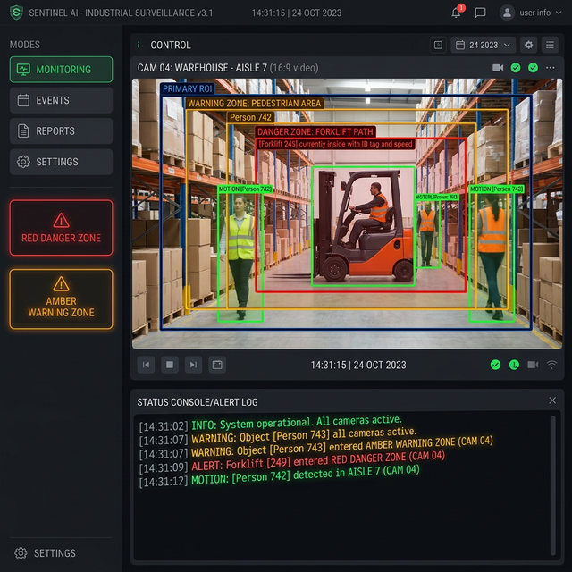

# AntiÑapas-Pons: Seguridad Industrial Inteligente



Sistema avanzado de vigilancia basada en visión artificial para control perimetral y seguridad de los operarios en las fábricas.

## Características
- **Visión por Computadora**: Mediapipe y OpenCV para lectura en tiempo real.
- **Privacidad Primero**: Filtro automático con superposición de cara de chimpancé para proteger identidades en las grabaciones.
- **Zonas de Peligro ROI**: Selección interactiva y manual de zonas (Roja - Prohibida, Naranja - Vigilancia).
- **Alarmas y Logs**: Sirenas visuales/auditivas, y guardado automático de fotos "capturas" en caso de intrusiones en zonas críticas.
- **Portal Web Monitor**: Monitoreo opcional a través de servidor web local.

## Requisitos
- Python 3.8+
- Cámara web o cámara conectada al sistema donde corre.

## Instalación y Uso
1. Navega a la carpeta principal del programa:
   ```bash
   cd Programa_Vision
   ```
2. Instala las dependencias (Nota: la descarga de Mediapipe puede requerir compilación C++ en ciertas versiones):
   ```bash
   pip install -r requirements.txt
   ```
3. Ejecuta el sistema central de vigilancia en vivo:
   ```bash
   python main_antinapas.py
   ```

## Estructura
- `Programa_Vision/`: Lógica central (con OpenCV y Mediapipe), interfaz web (`app_web.py`), audios de sirena y capturas de incidentes.
- `Documentacion/`: Investigación de IA aplicada a la prevención de riesgos (PRL).
